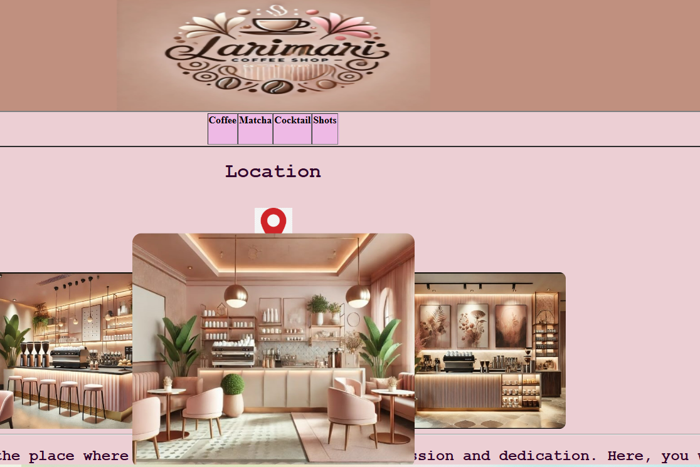
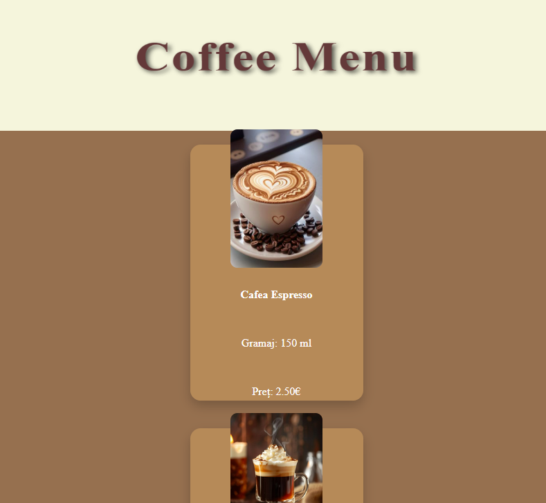
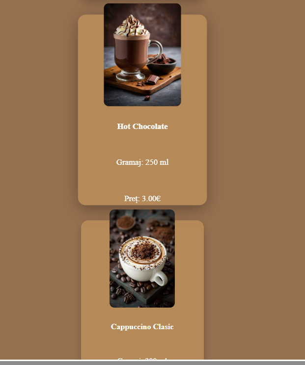
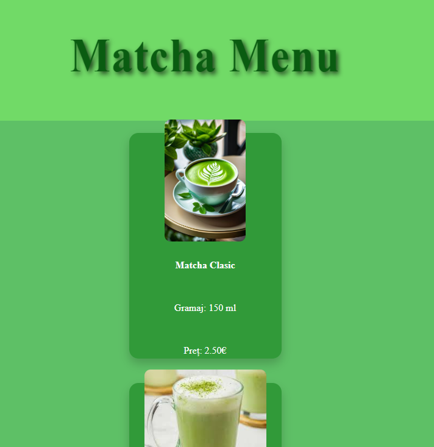
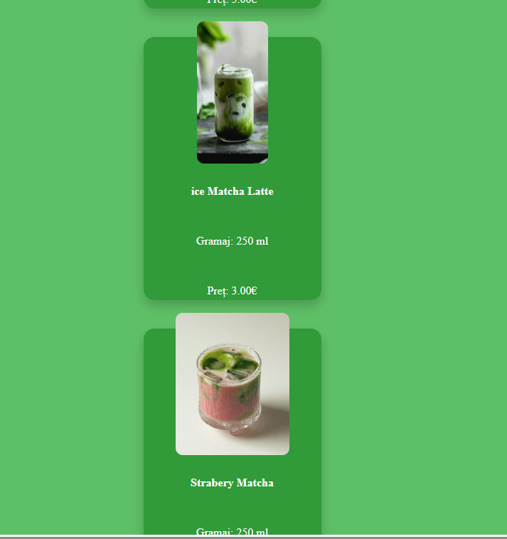
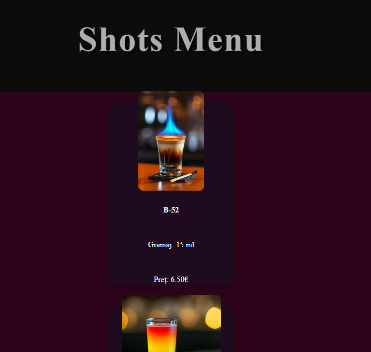
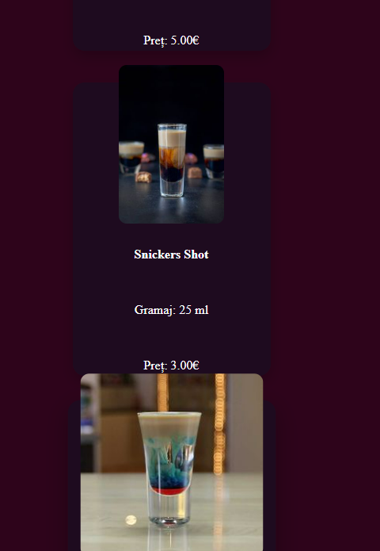
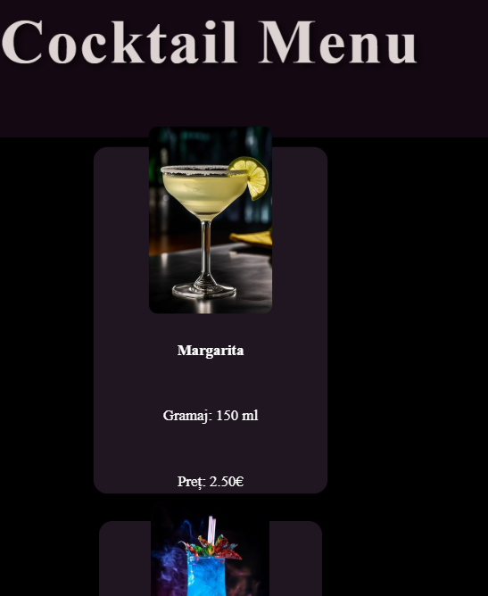
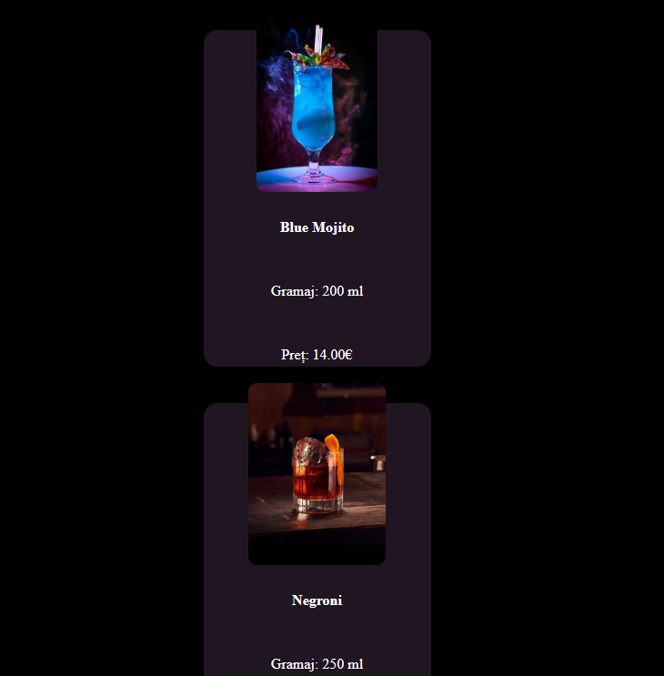

# ☕ Larimari Coffee & Bar - Digital Experience

**Larimari** is a modern, concept-driven coffee shop and bar landing page designed to offer customers a seamless digital menu experience. The project focuses on clean aesthetics, intuitive navigation, and interactive elements to reflect the vibrant atmosphere of the physical location.

---

##  Project Preview

| Main Landing Page | Interactive Gallery |

|  
|  |
|  |
---  |
  |

##  Key Features

### 1. Multi-Category Digital Menu
The website is structured into specialized sections, each with its own unique visual identity:
* **Coffee & Matcha:** Elegant layouts for daytime favorites.
* **Cocktails & Shots:** Dynamic designs tailored for the nightlife experience.

### 2. Interactive User Experience
* **Dynamic Gallery:** Images feature a smooth CSS `hover` effect with a 1.5x scale transition, providing a premium feel when browsing.
* **Smart Navigation:** A custom-styled navigation table allows users to jump between menus instantly.

### 3. Functional Location Integration
The "Location" section is not just a placeholder. It features a **live link to Google Maps**. Clicking the location icon redirects users directly to the map for real-time directions to Larimari.

### 4. Cohesive Branding
Using a warm color palette (`#c0907f` and soft pastels) and curated typography, the site maintains a professional brand image from the header to the footer.

---

##  Tech Stack

* **HTML5:** Semantic structure including headers, footers, and interactive tables.
* **CSS3:** * **Flexbox:** Used for perfect centering and responsive layouts.
    * **Animations:** Smooth transitions and `transform: scale()` for interactive images.
    * **Custom Styling:** Sophisticated use of borders, border-radii, and hover states.

---

##  Project Structure

```text
├── index.html          # Main Landing Page
├── coffemenu.html      # Coffee Menu
├── matchamenu.html     # Matcha Menu
├── coc.html            # Cocktail Menu
├── shot.html           # Shots Menu
├── termeni.html        # Terms & Conditions
├── contact.html        # Contact Page
└── img/                # Visual assets (Logo, Product Photos, Icons)
